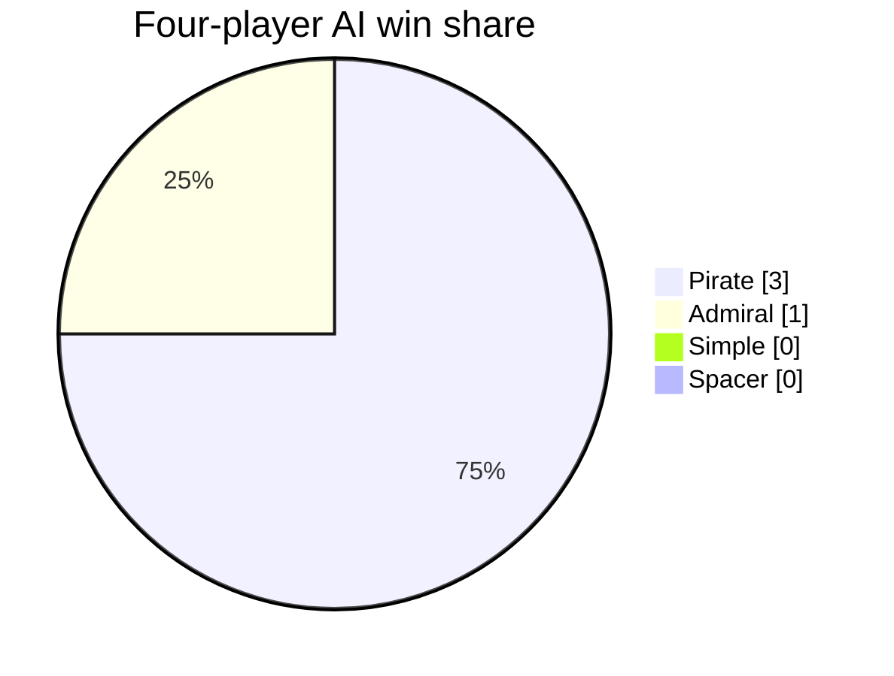
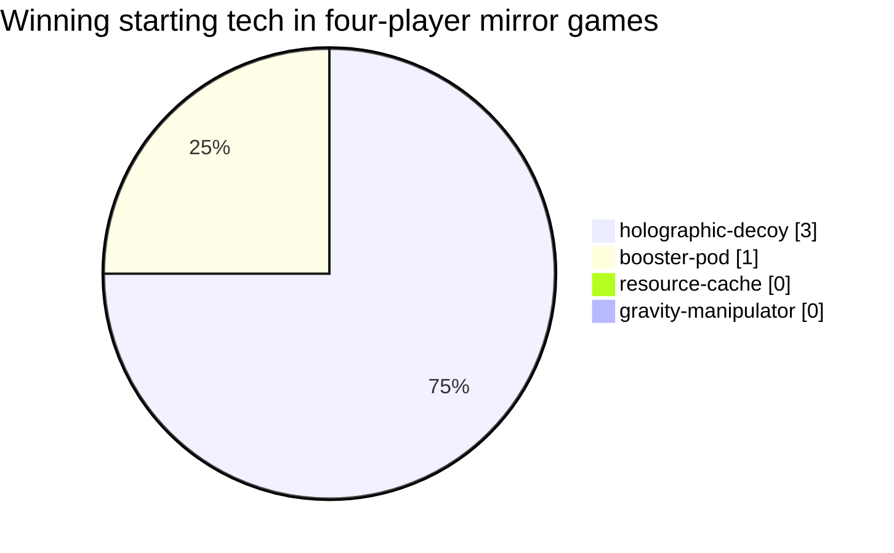
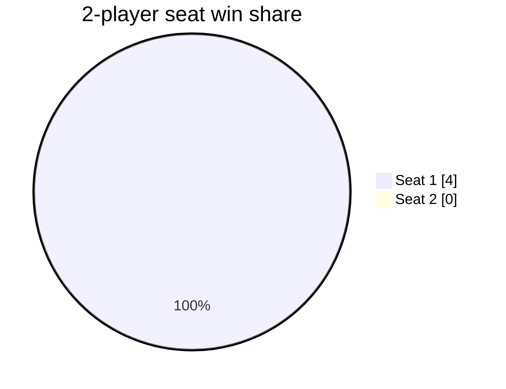
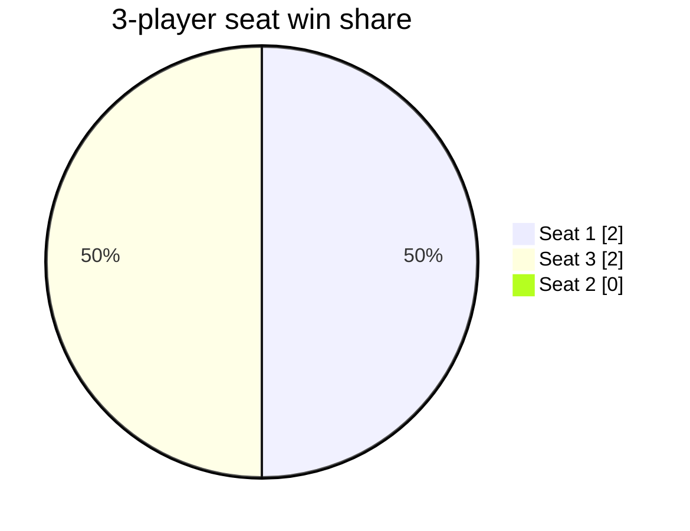
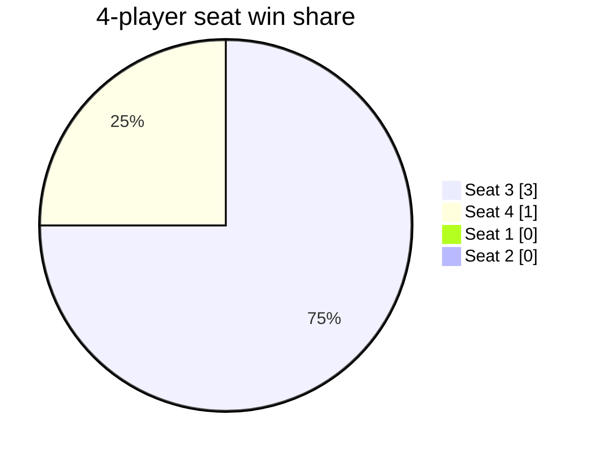

# Alien Frontiers AI Analysis: 2026-08-05

- Game version: `69635512` (dirty pilot)
- Games: 40 (40 completed)
- Seed blocks: 1, starting at 52000
- Search budget: 12,800 nodes
- Runtime: 160.9 seconds with 8 workers

## Four-Player AI Strength

| AI | Wins | Games | Win rate (95% CI) |
|---|---:|---:|---:|
| Pirate | 3 | 4 | 75.0% (30.1-95.4%) |
| Admiral | 1 | 4 | 25.0% (4.6-69.9%) |
| Simple | 0 | 4 | 0.0% (0.0-49.0%) |
| Spacer | 0 | 4 | 0.0% (0.0-49.0%) |

## Starting Tech

Mirror games isolate card effects from mixed AI strength.

| Starting tech | Wins | Games | Win rate (95% CI) |
|---|---:|---:|---:|
| holographic-decoy | 3 | 4 | 75.0% (30.1-95.4%) |
| booster-pod | 1 | 4 | 25.0% (4.6-69.9%) |
| resource-cache | 0 | 4 | 0.0% (0.0-49.0%) |
| gravity-manipulator | 0 | 4 | 0.0% (0.0-49.0%) |

## Turn Order

### 2 Players

| Turn order | Wins | Games | Win rate (95% CI) |
|---|---:|---:|---:|
| Seat 1 | 4 | 4 | 100.0% (51.0-100.0%) |
| Seat 2 | 0 | 4 | 0.0% (0.0-49.0%) |

### 3 Players

| Turn order | Wins | Games | Win rate (95% CI) |
|---|---:|---:|---:|
| Seat 1 | 2 | 4 | 50.0% (15.0-85.0%) |
| Seat 3 | 2 | 4 | 50.0% (15.0-85.0%) |
| Seat 2 | 0 | 4 | 0.0% (0.0-49.0%) |

### 4 Players

| Turn order | Wins | Games | Win rate (95% CI) |
|---|---:|---:|---:|
| Seat 3 | 3 | 4 | 75.0% (30.1-95.4%) |
| Seat 4 | 1 | 4 | 25.0% (4.6-69.9%) |
| Seat 1 | 0 | 4 | 0.0% (0.0-49.0%) |
| Seat 2 | 0 | 4 | 0.0% (0.0-49.0%) |

## Tech Ownership And Use

Final and ever-owned card results are observational associations. Power and discard uses are counted separately.

| Tech | Ownership games | Owner wins | Owner win rate | Power uses | Discard uses | Uses/ownership |
|---|---:|---:|---:|---:|---:|---:|
| resource-cache | 64 | 32 | 50.0% | 0 | 0 | 0.00 |
| booster-pod | 60 | 29 | 48.3% | 148 | 0 | 2.47 |
| holographic-decoy | 79 | 30 | 38.0% | 0 | 0 | 0.00 |
| temporal-warper | 33 | 12 | 36.4% | 0 | 24 | 0.73 |
| orbital-teleporter | 80 | 27 | 33.8% | 616 | 0 | 7.70 |
| alien-monument | 6 | 2 | 33.3% | 0 | 0 | 0.00 |
| stasis-beam | 79 | 22 | 27.8% | 40 | 47 | 1.10 |
| polarity-device | 44 | 11 | 25.0% | 65 | 0 | 1.48 |
| plasma-cannon | 37 | 7 | 18.9% | 41 | 0 | 1.11 |
| data-crystal | 24 | 4 | 16.7% | 55 | 0 | 2.29 |
| gravity-manipulator | 55 | 8 | 14.5% | 64 | 0 | 1.16 |
| alien-city | 20 | 2 | 10.0% | 0 | 0 | 0.00 |

## Final Region Control

Final control is an observational association, not a causal estimate.

| Region | Final controllers | Controller wins | Controller win rate |
|---|---:|---:|---:|
| Heinlein Plains | 26 | 22 | 84.6% |
| Burroughs Desert | 36 | 23 | 63.9% |
| Lem Badlands | 36 | 19 | 52.8% |
| Asimov Crater | 39 | 20 | 51.3% |
| Herbert Valley | 30 | 15 | 50.0% |
| Pohl Foothills | 37 | 17 | 45.9% |
| Bradbury Plateau | 31 | 14 | 45.2% |
| Van Vogt Mountains | 34 | 15 | 44.1% |

## Game Length

| Players | Games | Mean rounds | Median | Range |
|---:|---:|---:|---:|---:|
| 2 | 16 | 14.63 | 14.0 | 11-21 |
| 3 | 16 | 13.06 | 13.0 | 11-17 |
| 4 | 8 | 11.50 | 10.5 | 10-17 |

## Turns-Remaining Accuracy

Positive mean error means the current estimator is pessimistic; negative means optimistic.

| Players | Samples | Mean error | MAE | RMSE |
|---:|---:|---:|---:|---:|
| 2 | 487 | -2.71 | 2.91 | 3.95 |
| 3 | 655 | -2.28 | 2.47 | 3.21 |
| 4 | 390 | -2.51 | 2.66 | 3.66 |

## Timing Projection

This run completed 0.249 games/second. At the same throughput, 201 complete 40-game blocks (8,040 games) would take approximately 8.98 hours.

## Raw Data

- [Player-game results](games.csv)
- [Tech results](tech.csv)
- [Region results](regions.csv)
- [Turns-remaining samples](turn-estimates.csv)
- [Manifest and timing](manifest.json)
