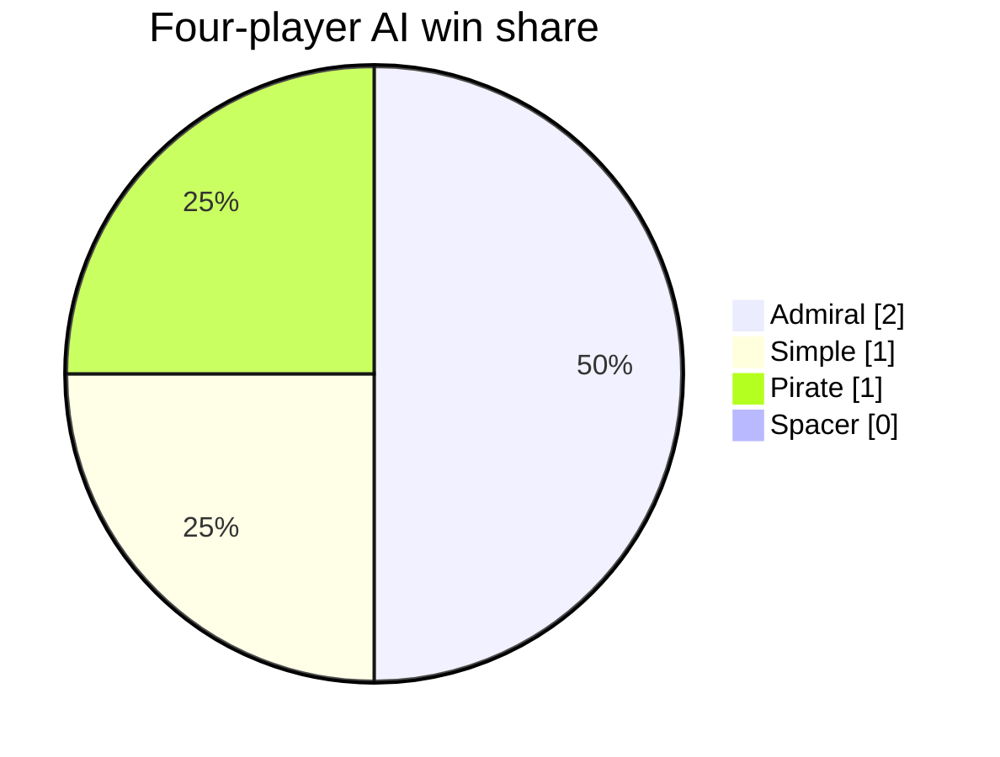
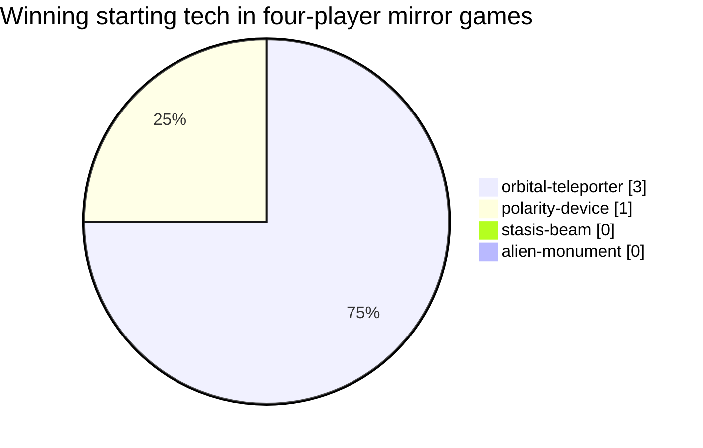
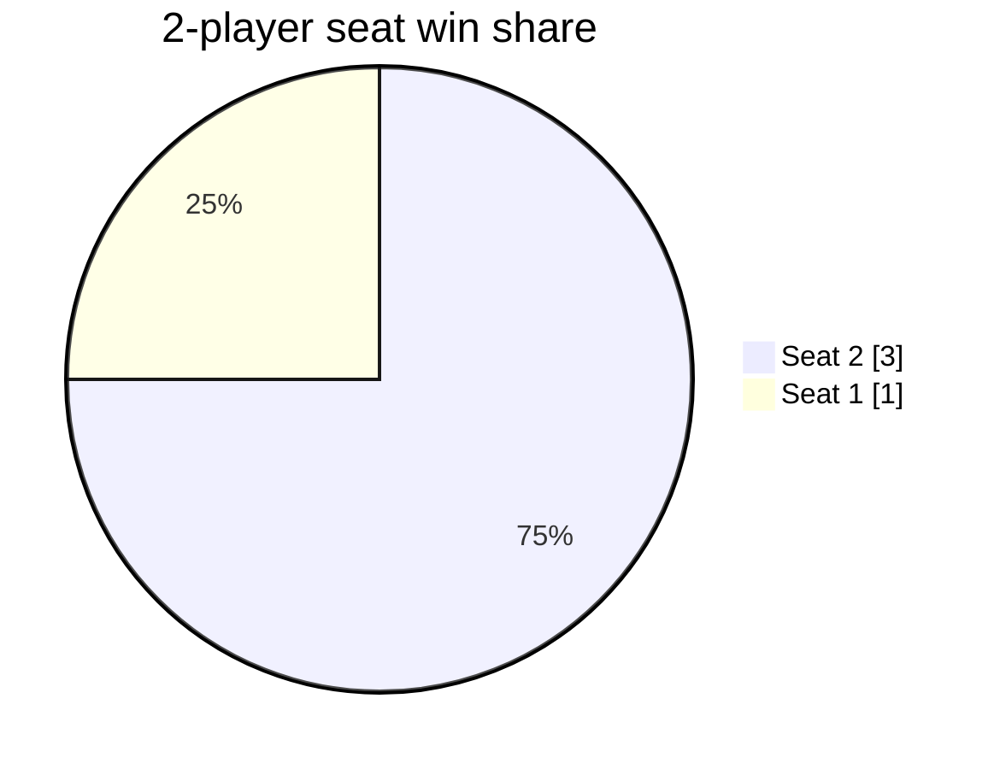
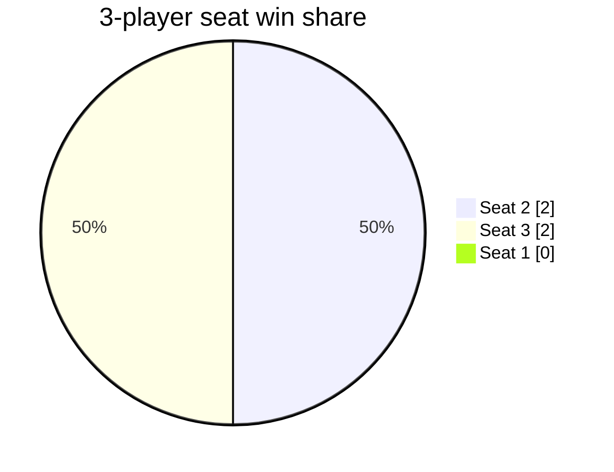
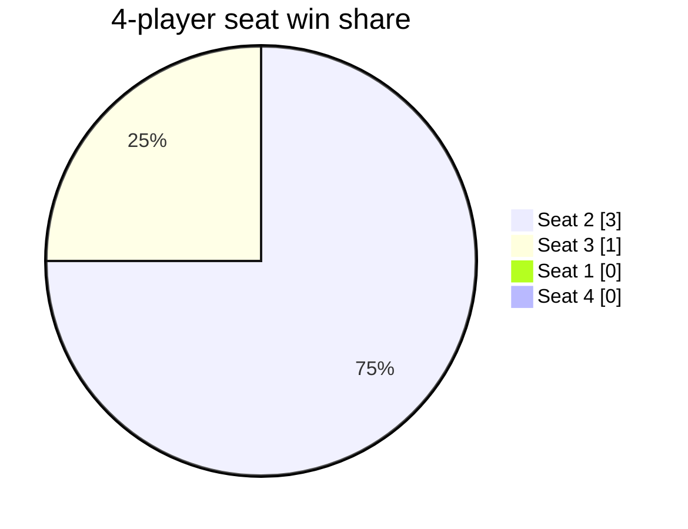

# Alien Frontiers AI Analysis: 2026-08-05

- Game version: `69635512` (dirty pilot)
- Games: 40 (40 completed)
- Seed blocks: 1, starting at 51000
- Search budget: 100 nodes
- Runtime: 4.7 seconds with 8 workers

## Four-Player AI Strength

| AI | Wins | Games | Win rate (95% CI) |
|---|---:|---:|---:|
| Admiral | 2 | 4 | 50.0% (15.0-85.0%) |
| Simple | 1 | 4 | 25.0% (4.6-69.9%) |
| Pirate | 1 | 4 | 25.0% (4.6-69.9%) |
| Spacer | 0 | 4 | 0.0% (0.0-49.0%) |

## Starting Tech

Mirror games isolate card effects from mixed AI strength.

| Starting tech | Wins | Games | Win rate (95% CI) |
|---|---:|---:|---:|
| orbital-teleporter | 3 | 4 | 75.0% (30.1-95.4%) |
| polarity-device | 1 | 4 | 25.0% (4.6-69.9%) |
| stasis-beam | 0 | 4 | 0.0% (0.0-49.0%) |
| alien-monument | 0 | 4 | 0.0% (0.0-49.0%) |

## Turn Order

### 2 Players

| Turn order | Wins | Games | Win rate (95% CI) |
|---|---:|---:|---:|
| Seat 2 | 3 | 4 | 75.0% (30.1-95.4%) |
| Seat 1 | 1 | 4 | 25.0% (4.6-69.9%) |

### 3 Players

| Turn order | Wins | Games | Win rate (95% CI) |
|---|---:|---:|---:|
| Seat 2 | 2 | 4 | 50.0% (15.0-85.0%) |
| Seat 3 | 2 | 4 | 50.0% (15.0-85.0%) |
| Seat 1 | 0 | 4 | 0.0% (0.0-49.0%) |

### 4 Players

| Turn order | Wins | Games | Win rate (95% CI) |
|---|---:|---:|---:|
| Seat 2 | 3 | 4 | 75.0% (30.1-95.4%) |
| Seat 3 | 1 | 4 | 25.0% (4.6-69.9%) |
| Seat 1 | 0 | 4 | 0.0% (0.0-49.0%) |
| Seat 4 | 0 | 4 | 0.0% (0.0-49.0%) |

## Tech Ownership And Use

Final and ever-owned card results are observational associations. Power and discard uses are counted separately.

| Tech | Ownership games | Owner wins | Owner win rate | Power uses | Discard uses | Uses/ownership |
|---|---:|---:|---:|---:|---:|---:|
| orbital-teleporter | 57 | 25 | 43.9% | 351 | 0 | 6.16 |
| booster-pod | 40 | 13 | 32.5% | 16 | 0 | 0.40 |
| resource-cache | 14 | 4 | 28.6% | 0 | 0 | 0.00 |
| holographic-decoy | 18 | 5 | 27.8% | 0 | 0 | 0.00 |
| temporal-warper | 18 | 5 | 27.8% | 0 | 3 | 0.17 |
| polarity-device | 55 | 15 | 27.3% | 90 | 0 | 1.64 |
| alien-city | 8 | 2 | 25.0% | 0 | 0 | 0.00 |
| stasis-beam | 57 | 14 | 24.6% | 15 | 21 | 0.63 |
| data-crystal | 40 | 8 | 20.0% | 18 | 2 | 0.50 |
| plasma-cannon | 24 | 4 | 16.7% | 0 | 0 | 0.00 |
| gravity-manipulator | 25 | 4 | 16.0% | 0 | 0 | 0.00 |
| alien-monument | 26 | 2 | 7.7% | 0 | 0 | 0.00 |

## Final Region Control

Final control is an observational association, not a causal estimate.

| Region | Final controllers | Controller wins | Controller win rate |
|---|---:|---:|---:|
| Heinlein Plains | 21 | 20 | 95.2% |
| Asimov Crater | 34 | 20 | 58.8% |
| Burroughs Desert | 33 | 18 | 54.5% |
| Herbert Valley | 34 | 18 | 52.9% |
| Van Vogt Mountains | 37 | 18 | 48.6% |
| Lem Badlands | 37 | 16 | 43.2% |
| Pohl Foothills | 33 | 14 | 42.4% |
| Bradbury Plateau | 38 | 13 | 34.2% |

## Game Length

| Players | Games | Mean rounds | Median | Range |
|---:|---:|---:|---:|---:|
| 2 | 16 | 17.63 | 17.0 | 13-41 |
| 3 | 16 | 15.25 | 15.0 | 12-24 |
| 4 | 8 | 14.00 | 14.0 | 12-17 |

## Turns-Remaining Accuracy

Positive mean error means the current estimator is pessimistic; negative means optimistic.

| Players | Samples | Mean error | MAE | RMSE |
|---:|---:|---:|---:|---:|
| 2 | 588 | -5.51 | 5.58 | 8.57 |
| 3 | 766 | -3.92 | 4.00 | 5.19 |
| 4 | 467 | -3.58 | 3.67 | 4.57 |

## Timing Projection

This run completed 8.498 games/second. At the same throughput, 6,882 complete 40-game blocks (275,280 games) would take approximately 9.00 hours.

## Raw Data

- [Player-game results](games.csv)
- [Tech results](tech.csv)
- [Region results](regions.csv)
- [Turns-remaining samples](turn-estimates.csv)
- [Manifest and timing](manifest.json)
