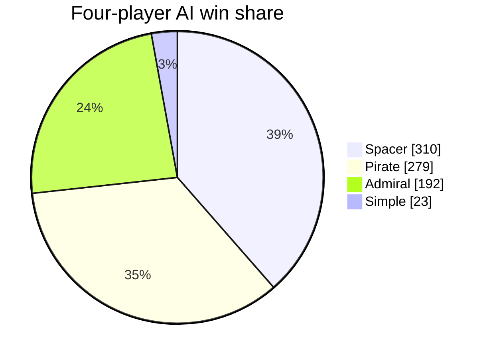
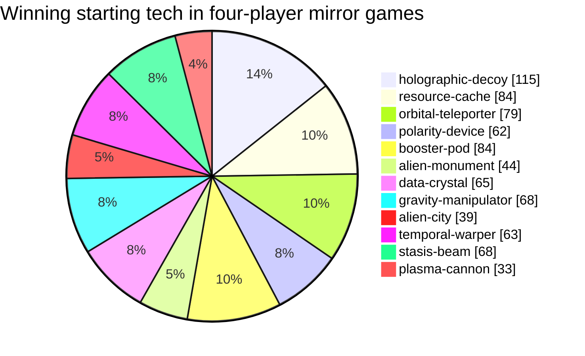
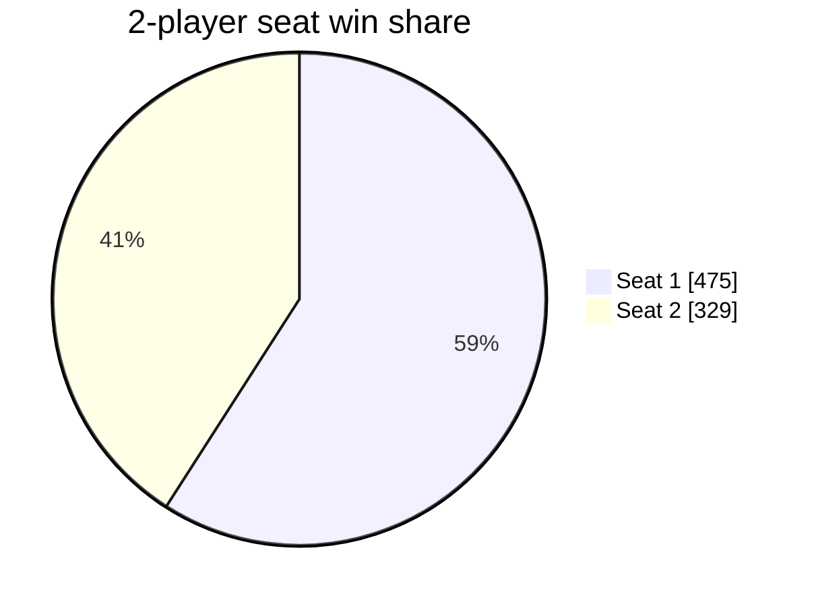
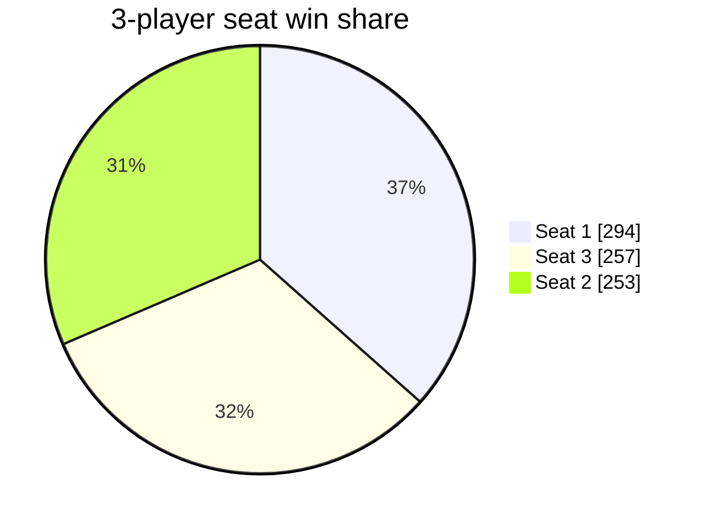
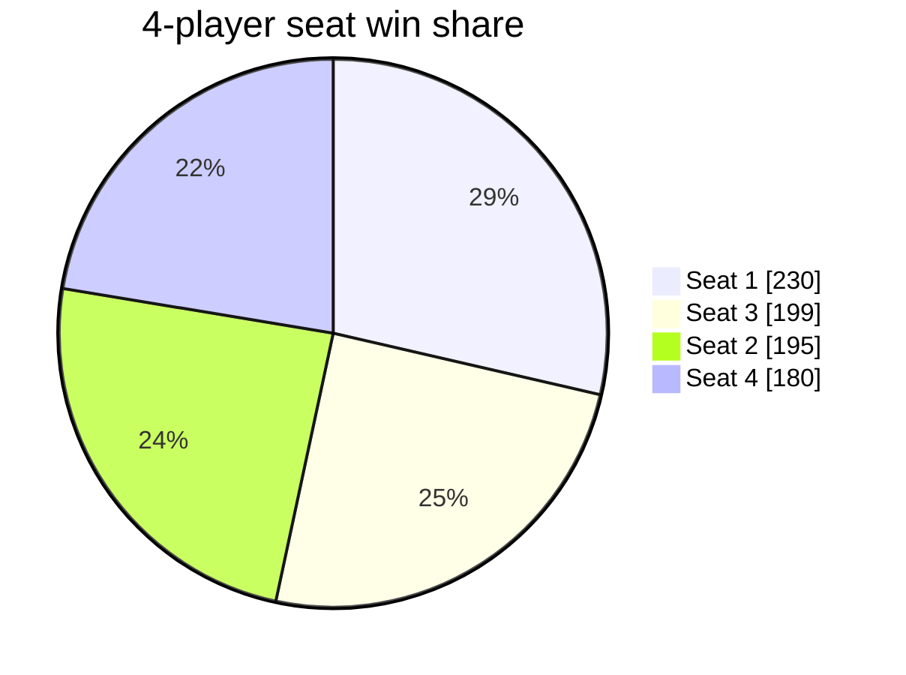

# Alien Frontiers AI Analysis: 2026-08-05

- Game version: `97e5f099`
- Games: 8040 (8040 completed)
- Seed blocks: 201, starting at 60000
- Search budget: 12,800 nodes
- Runtime: 46809.6 seconds with 8 workers

## Executive Summary

- All 8,040 games completed with no did-not-finish results.
- Spacer descriptively led the four-player mixed tournament at 38.6%, followed by Pirate at
    34.7%, Admiral at 23.9%, and Simple at 2.9%. The paired seed-block Spacer-Pirate difference
    was +3.9 percentage points (95% interval -2.1 to +9.8), so Spacer and Pirate are an unresolved
    top tier. Both clearly outperformed Admiral under matched participation and cyclic rotation.
- In four-player mirror games, Holographic Decoy (35.5%) and Resource Cache (32.8%) were the
    strongest starting-tech predictors. Plasma Cannon was lowest at 12.1%. Starting cards are
    randomly dealt, making this stronger evidence than final ownership associations.
- First seat won 59.1% of two-player mirror games, 36.6% of three-player games, and 28.6% of
    four-player games. This measures the complete seat package, including starting resources.
- The current turns-remaining estimator was optimistic by 2.63 to 2.76 rounds on average, with
    mean absolute error between 2.77 and 2.92 rounds across player counts.
- Final control of Heinlein Plains had the strongest observed association with victory at
    87.1%. Final region control and tech ownership remain observational and should be used to
    choose controlled weight experiments, not interpreted directly as causal value.

## Four-Player AI Strength

| AI | Wins | Games | Win rate (95% CI) |
|---|---:|---:|---:|
| Spacer | 310 | 804 | 38.6% (35.3-42.0%) |
| Pirate | 279 | 804 | 34.7% (31.5-38.1%) |
| Admiral | 192 | 804 | 23.9% (21.1-26.9%) |
| Simple | 23 | 804 | 2.9% (1.9-4.3%) |

Spacer's apparent lead is specific to this four-player field. Pirate beat Spacer 60.0% to
40.0% in their direct two-player matchup. In the three-player matchup containing Spacer,
Admiral, and Pirate, Spacer led 37.3% to Pirate's 33.2%, but that paired difference was also
unresolved (95% interval -2.3 to +10.4 percentage points).

## Starting Tech

Mirror games isolate card effects from mixed AI strength.

| Starting tech | Wins | Games | Win rate (95% CI) |
|---|---:|---:|---:|
| holographic-decoy | 115 | 324 | 35.5% (30.5-40.8%) |
| resource-cache | 84 | 256 | 32.8% (27.4-38.8%) |
| orbital-teleporter | 79 | 296 | 26.7% (22.0-32.0%) |
| polarity-device | 62 | 236 | 26.3% (21.1-32.2%) |
| booster-pod | 84 | 320 | 26.3% (21.7-31.3%) |
| alien-monument | 44 | 168 | 26.2% (20.1-33.3%) |
| data-crystal | 65 | 264 | 24.6% (19.8-30.2%) |
| gravity-manipulator | 68 | 288 | 23.6% (19.1-28.8%) |
| alien-city | 39 | 176 | 22.2% (16.7-28.9%) |
| temporal-warper | 63 | 288 | 21.9% (17.5-27.0%) |
| stasis-beam | 68 | 328 | 20.7% (16.7-25.4%) |
| plasma-cannon | 33 | 272 | 12.1% (8.8-16.5%) |

## Turn Order

### 2 Players

| Turn order | Wins | Games | Win rate (95% CI) |
|---|---:|---:|---:|
| Seat 1 | 475 | 804 | 59.1% (55.6-62.4%) |
| Seat 2 | 329 | 804 | 40.9% (37.6-44.4%) |

### 3 Players

| Turn order | Wins | Games | Win rate (95% CI) |
|---|---:|---:|---:|
| Seat 1 | 294 | 804 | 36.6% (33.3-40.0%) |
| Seat 3 | 257 | 804 | 32.0% (28.8-35.3%) |
| Seat 2 | 253 | 804 | 31.5% (28.4-34.8%) |

### 4 Players

| Turn order | Wins | Games | Win rate (95% CI) |
|---|---:|---:|---:|
| Seat 1 | 230 | 804 | 28.6% (25.6-31.8%) |
| Seat 3 | 199 | 804 | 24.8% (21.9-27.8%) |
| Seat 2 | 195 | 804 | 24.3% (21.4-27.3%) |
| Seat 4 | 180 | 804 | 22.4% (19.6-25.4%) |

## Tech Ownership And Use

Final and ever-owned card results are observational associations. Power and discard uses are counted separately.

| Tech | Ownership games | Owner wins | Owner win rate | Power uses | Discard uses | Uses/ownership |
|---|---:|---:|---:|---:|---:|---:|
| orbital-teleporter | 9961 | 3878 | 38.9% | 61482 | 0 | 6.17 |
| resource-cache | 9705 | 3753 | 38.7% | 0 | 0 | 0.00 |
| polarity-device | 9597 | 3168 | 33.0% | 24451 | 0 | 2.55 |
| temporal-warper | 6878 | 2249 | 32.7% | 0 | 2989 | 0.43 |
| holographic-decoy | 9938 | 3198 | 32.2% | 0 | 0 | 0.00 |
| data-crystal | 9646 | 3095 | 32.1% | 28206 | 1439 | 3.07 |
| booster-pod | 9693 | 3006 | 31.0% | 21965 | 0 | 2.27 |
| stasis-beam | 10396 | 3189 | 30.7% | 5666 | 5719 | 1.10 |
| gravity-manipulator | 5699 | 1443 | 25.3% | 3297 | 0 | 0.58 |
| plasma-cannon | 9059 | 2271 | 25.1% | 15346 | 0 | 1.69 |
| alien-monument | 3507 | 668 | 19.0% | 0 | 0 | 0.00 |
| alien-city | 3764 | 646 | 17.2% | 0 | 0 | 0.00 |

## Final Region Control

Final control is an observational association, not a causal estimate.

| Region | Final controllers | Controller wins | Controller win rate |
|---|---:|---:|---:|
| Heinlein Plains | 5505 | 4796 | 87.1% |
| Asimov Crater | 7326 | 4246 | 58.0% |
| Herbert Valley | 7194 | 3867 | 53.8% |
| Burroughs Desert | 6724 | 3562 | 53.0% |
| Pohl Foothills | 6441 | 3245 | 50.4% |
| Van Vogt Mountains | 6892 | 3446 | 50.0% |
| Bradbury Plateau | 6230 | 2982 | 47.9% |
| Lem Badlands | 6584 | 3150 | 47.8% |

## Game Length

| Players | Games | Mean rounds | Median | Range |
|---:|---:|---:|---:|---:|
| 2 | 3216 | 14.14 | 14.0 | 9-39 |
| 3 | 3216 | 13.29 | 13.0 | 9-28 |
| 4 | 1608 | 11.86 | 12.0 | 8-20 |

## Turns-Remaining Accuracy

Positive mean error means the current estimator is pessimistic; negative means optimistic.

| Players | Samples | Mean error | MAE | RMSE |
|---:|---:|---:|---:|---:|
| 2 | 95546 | -2.63 | 2.87 | 4.10 |
| 3 | 134388 | -2.76 | 2.92 | 3.81 |
| 4 | 80149 | -2.62 | 2.77 | 3.57 |

## Timing Projection

This run completed 0.172 games/second. At the same throughput, 139 complete 40-game blocks (5,560 games) would take approximately 8.99 hours.

## Raw Data

- [Player-game results](games.csv)
- [Tech results](tech.csv)
- [Region results](regions.csv)
- [Turns-remaining samples](turn-estimates.csv)
- [Manifest and timing](manifest.json)
